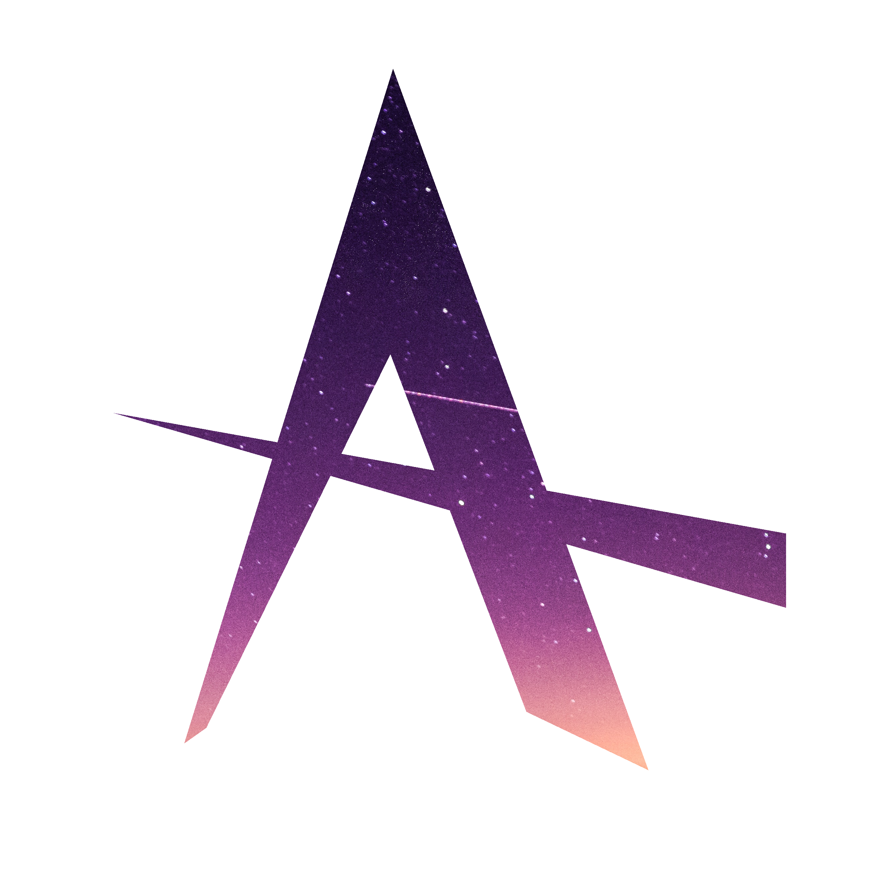

# adna
An Open Source To-Do List Program: Built from the ground up to be lightweight, easy to run, easy to use, and awesome.

Any contributions you can make would be greatly appreciated!

### How to run with Docker
Follow the instructions [here](https://hub.docker.com/r/lincolnthedev/adna).

### Discord

[discord.gg/PBzyWwp7wG](https://discord.gg/PBzyWwp7wG)

### To Do
    - Fix Rest API
    - Ability to import from other platforms (such as Remember the Milk)
    - More fields on tasks
    - Clean up code

### Donate
Donations coming soon
